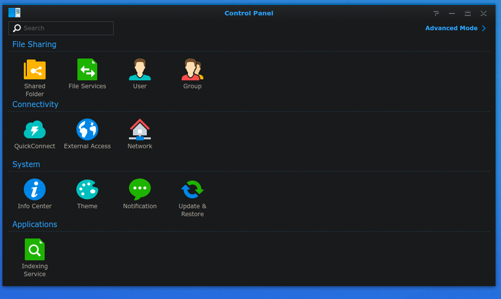
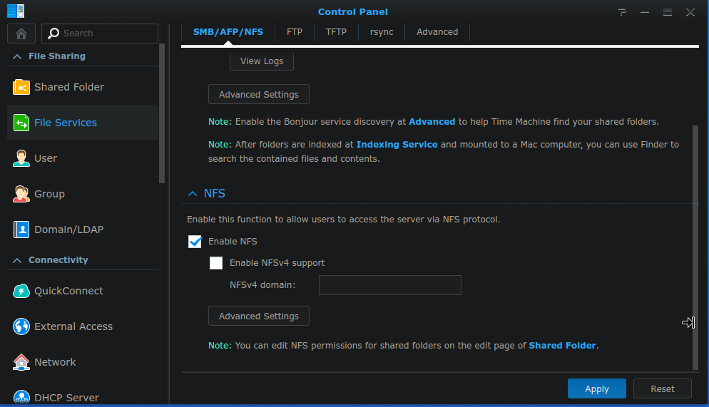
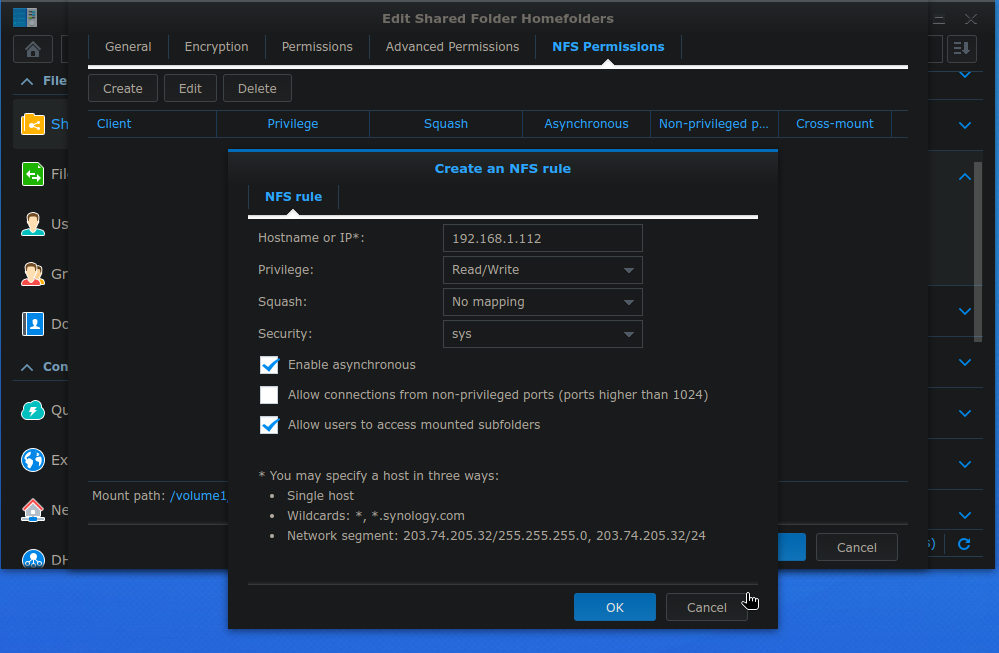
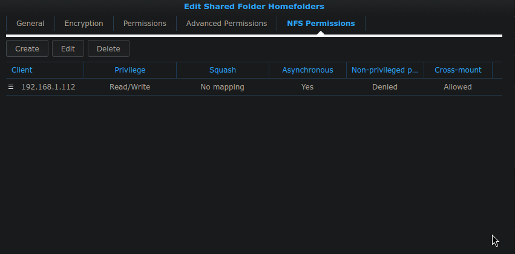
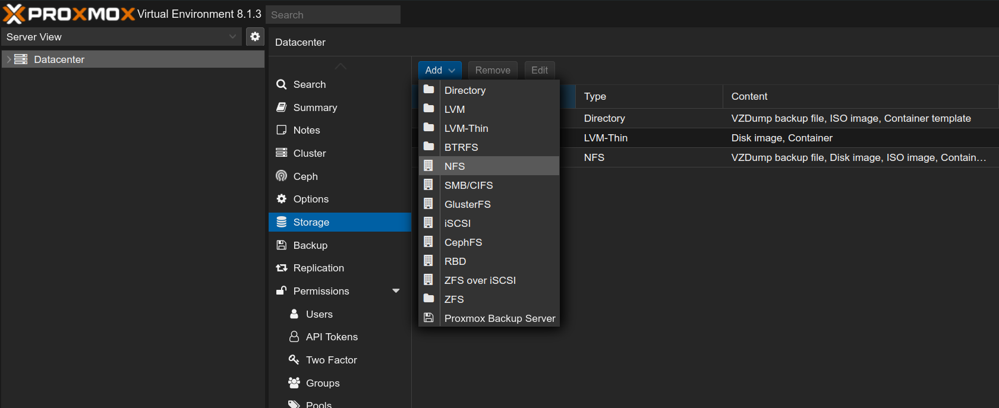
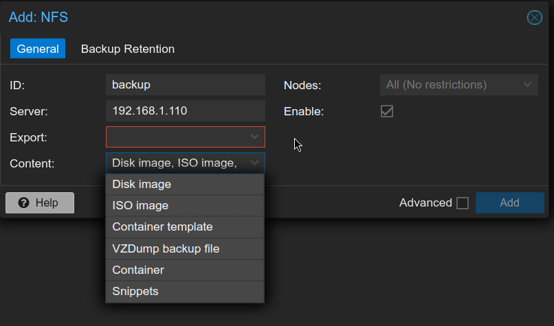
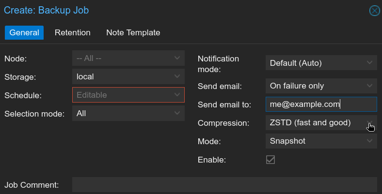
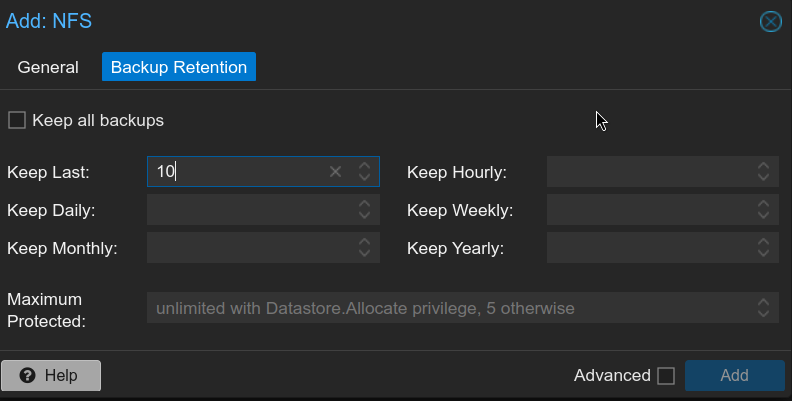

## Introduction
I have been using Proxmox for a while now, and I have been very happy with it.
It is a powerful virtualization platform that allows me to run multiple virtual machines on a single server. One of the things I like about Proxmox is that it is open-source and has a great community behind it.
Whenever I set up a new Proxmox server, I always make sure to configure a backup solution to protect my data. In this post, I will share how I set up a backup solution for my Proxmox server using a NAS.

## Why Backup?
Having a backup solution is essential to protect your data in case of hardware failure, data corruption, or accidental deletion.
Even if the server is running on a RAID array, it is still important to have a backup solution in place. RAID protects against disk failure, but it does not protect against other types of data loss.

## NAS Setup
Start by enabling NFS on your NAS. This will allow the Proxmox server to mount the NAS as a network share.
Depending on the NAS OS version, it may look different, but it is usually located in (Control Panel -> File Services -> NFS).

After locating the section, enable NFS and set the permissions to allow the Proxmox server to write to it.

To set the permissions, you will need to create a new shared folder, and then set the permissions for the Proxmox server.

In some cases when the backup fails to access writing, you may want to squash the permissions to a specific user.
Also allow users to access mounted subfolders.

## Proxmox Setup
On the Proxmox server, you will need to mount the NFS share. You can do this by using the GUI or the command line.
In this case I will use the GUI to add a storage device.

Navigate to Datacenter -> Storage -> Add -> NFS.
Fill in the details for the NFS share, and make sure to set the content to backup everything you need. In my case I select all options.

After adding the NFS share, you can now use it as a backup location for your Proxmox server.
Start by creating a new backup job, and select the NFS share as the destination.

You can now schedule the backup job to run at specific times, and configure the retention policy.

After setting up the backup job, you can monitor the progress and check the logs to ensure that the backups are running successfully.

## Conclusion
Setting up a backup solution for your Proxmox server is essential to protect your data and ensure that you can recover in case of a disaster.
By using a NAS as a backup location, you can store your backups off-site and protect against data loss pretty easily.
I hope this post helps you set up a backup solution for your Proxmox server and keep your data safe. If you have any questions or need help, feel free to email me.
