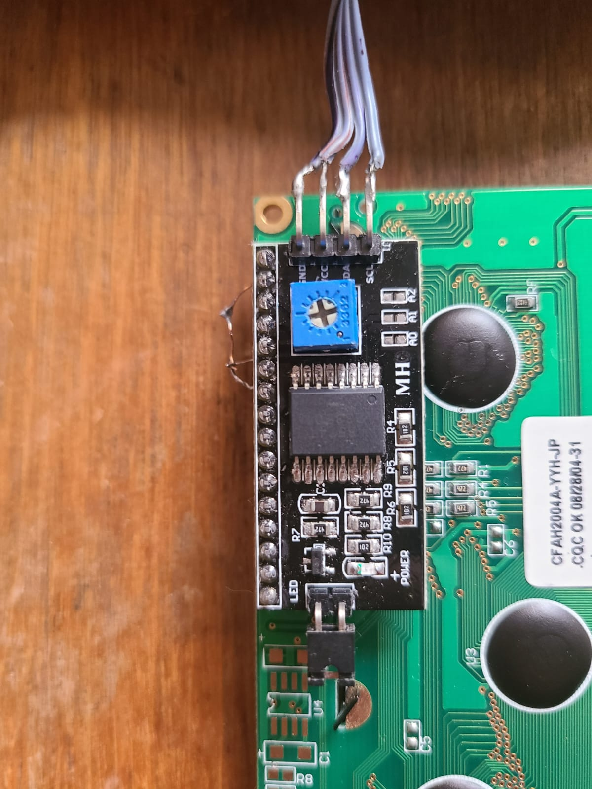
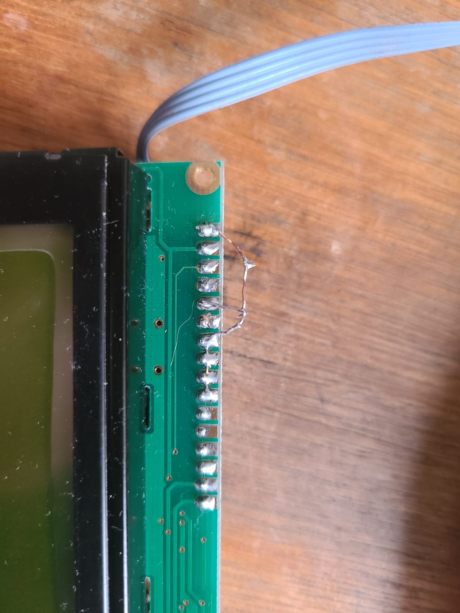

Toit is a high-level language for IoT devices. It is a language that is easy to learn and use, and it is designed to be used with ESP32 MCUs.
The ESP32 is a powerful microcontroller that can be used in a wide range of applications, from simple IoT devices to complex robotics projects.
There are however some limitations to the ESP32, and one of them is the amount of GPIO pins available.
# PCF8574
The PCF8574 is a 8-bit I/O expander that can be used to increase the number of GPIO pins available to the ESP32.
The PCF8574 is controlled via the I2C bus, which means that it only requires two pins to communicate with the ESP32.
The driver for the PCF8574 is available in the Toit package repository.
I'll be using a module that has a PCF8574 I2C adapter to operate an LCD display.
In this article, we will explore how to use Toit to operate an LCD display (HD44780) with a PCF8574 I2C adapter.
# HD44780
The HD44780 is an old and popular chipset that is used in many LCD displays. Its interface is parallel, which means that it requires a lot of GPIO pins to operate.
I'm using a 20x4 LCD display with an HD44780 chipset, but the code should work with other displays that use the same chipset.
The actual driver for the HD44780 is available in the Toit package repository, but it is not that complicated to write your own driver.

# Connecting the PCF8574 to the LCD display

The module works with I2C, so it only requires two pins to communicate with the ESP32. I connected SDA to pin 21 and SCL to pin 22 on the ESP32.
The module has a default address of 0x27, but it can be changed by soldering the A0-A2 pads on the module.
Although the module has 16 pins only 8 are actually connected to the PCF8574.

Pin | Function
--- | ---
GND | Ground
VCC | 5V
VQ  | Contrast adjustment
P0  | Register select
P1  | Read/Write
P2  | Enable
P3  | Backlight
NC  | Not connected
NC  | Not connected
NC  | Not connected
NC  | Not connected
P4  | D4
P5  | D5
P6  | D6
P7  | D7
GND | Ground
VBL | 5V Backlight



I intentionally grounded the R/W pin on the LCD display, as I'm only interested in writing to the display.
I also grounded the unused pins D0-D3 on the LCD display, as I'm using 4-bit mode.
One could use the 8-bit mode, but that would require more pins. The PCF8575 would be a better choice for that.
The LCD I'm using works only with 5V, I'd recommend using a level shifter if you're using an ESP32.
In my case I skipped the level shifter, and the ESP32 seems to be able to handle the 5V logic.

# Writing the code
The code uses the Toit driver for the HD44780, and the PCF8574 driver.
I've used VirtualPins to manage the connection to the LCD display.
```
import gpio
import i2c
import hd44780 show *
import pcf8574 show *

pcf-pin pcf/PCF8574 n/int -> Lambda:
  return ::
    if it == 1:
      pcf.clear --pin=n
    else:
      pcf.set --pin=n

main:
  sda := gpio.Pin 21
  scl := gpio.Pin 22
  bus := i2c.Bus --sda=sda --scl=scl --frequency=100_000

  device := bus.device 0x27
  pcf ::= PCF8574 device

  EN-PIN ::= gpio.VirtualPin (pcf-pin pcf 2)
  RS-PIN ::= gpio.VirtualPin (pcf-pin pcf 0)
  D4-PIN ::= gpio.VirtualPin (pcf-pin pcf 4)
  D5-PIN ::= gpio.VirtualPin (pcf-pin pcf 5)
  D6-PIN ::= gpio.VirtualPin (pcf-pin pcf 6)
  D7-PIN ::= gpio.VirtualPin (pcf-pin pcf 7)

  display := Hd44780
      --type = Hd44780.LCD-20x4
      --en = EN-PIN
      --rs = RS-PIN
      --d4 = D4-PIN
      --d5 = D5-PIN
      --d6 = D6-PIN
      --d7 = D7-PIN

  display.write --row=0 --column=1  "Test line"
  sleep --ms=2000

  2.repeat:
    display.shift-display --left
    sleep --ms=200
  5.repeat:
    display.shift-display --right
    sleep --ms=200
  3.repeat:
    display.shift-display --left 1
    sleep --ms=200

  sleep --ms=1000

  display.write  --row=1 --column=5
      Hd44780.translate-to-rom-a-00 "→toit←"  // Special characters requires translate_to_rom_a_00.
  sleep --ms=2000

  5.repeat:
    display.shift-display --right
    sleep --ms=200
  7.repeat:
    display.shift-display --left
    sleep --ms=200
  3.repeat:
    display.shift-display --right 1
    sleep --ms=200
  sleep --ms=2000
  display.clear

```
The code is pretty straightforward, it initializes the I2C bus, and the PCF8574 device. It then initializes the HD44780 driver.
